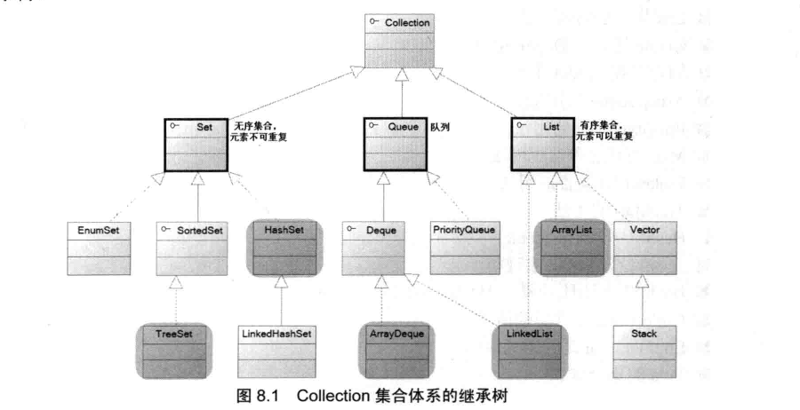
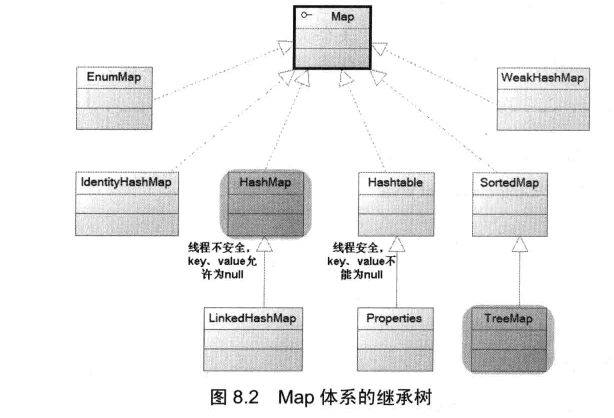

###[集合相关的总结](https://www.xiaogzcool.top/)

### 集合相关要点

>* 集合的概念和作用
>* 使用Lambda表达式遍历集合
>* Collection集合的常规用法
>* 使用Predicate操作集合
>* 使用Iterator和foreach循环遍历Collection集合
>* HashSet,LinkedHashSet的用法
>* 对集合使用Stream进行流式遍历编程
>* EnumSet的用法
>* TreeSet的用法
>* ArrayList和Vector
>* List集合的常规用法
>* Queue接口与Deque接口
>* 固定长度的List集合
>* ArrayDueue的用法
>* PriorityQueue的用法
>* Map的概念和常规用法
>* LinkedList集合的用法
>* TreeMap的用法
>* HashMap和Hashtable
>* 几种特殊的Map实现类
>* Hash算法对HashSet,HashMap性能的影响
>* Collections工具类的用法
>* Enumeration迭代器的用法
>* Java的集合体系 

-------------

1.集合的分类
>   Java集合大致可分为Set,List,Queue和Map四种体系,其中Set代表无序,不可重复的集合;
>List代表有序,重复的集合;而Map则代表具有映射关系的集合,Java5又增加了Queue体系集合,代表
一种队列集合实现.

2.**Set集合**

_Set_

*HashSet类
>HashSet按Hash算法来存储集合中的元素,因此具有很好的存取和查找性能
>HashSet具有以下特点:
>>-不能保证元素的排列顺序,顺序可能与添加的顺序不同,顺序也有可能发生变化.
>>-HashSet不是同步的,如果多个线程同时访问一个HashSet,假设有两个或者两个以上县城同时修改了HashSet集合时,则必须通过代码来保证其同步.
>>-集合元素值可以为null.

>当向HashSet集合中存入一个元素时,HashSet会调用该对象的HashCode()方法来得到该对象的hashCode值,然后根据hashCode
值决定该对象在HashSet中的储存位置,如果有两个元素通过equals()方法比较返回true,但他们的hashCode()方法返回值不相等,HashSet将会把他们存储到不同的位置,依然可以添加成功,
也就是说,HashSet集合判断两个元素相等的标准是两个对象通过equals()方法比较相等,并且两个对象的hashCode()方法返回值也相等.
>注:当向HashSet中添加可变对象时,必须十分小心,如果修改HashSet集合中的对象,有可能导致该对象与集合中的其他对象相等,从而导致HashSet无法准确访问该对象.
3.List集合

4.Map集合

More info: [LOVE](https://www.xiaogzcool.top)
